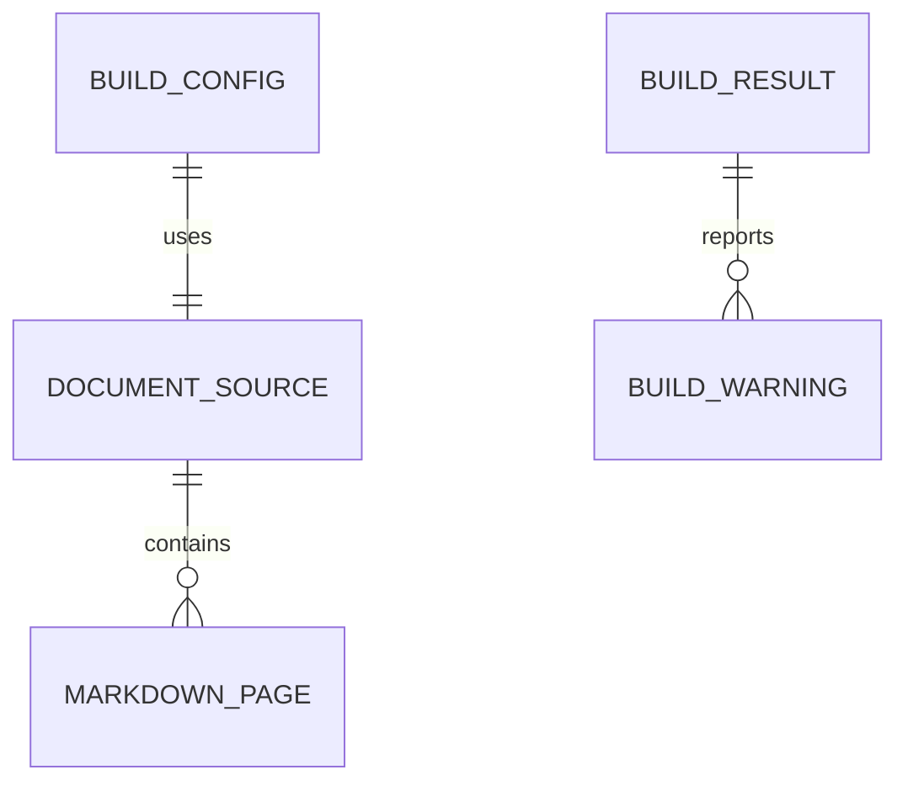

# 实体关系

<!-- BEGIN: auto-generated -->

当前没有持久化实体关系。以下是未来可能的内存对象关系草图：

```mermaid
erDiagram
    DOCUMENT_SOURCE ||--o{ MARKDOWN_PAGE : contains
    BUILD_CONFIG ||--|| DOCUMENT_SOURCE : uses
    BUILD_RESULT ||--o{ BUILD_WARNING : reports
```

<!-- TODO: 实现真实模型后，替换为准确的实体关系图。 -->

<!-- END: auto-generated -->
